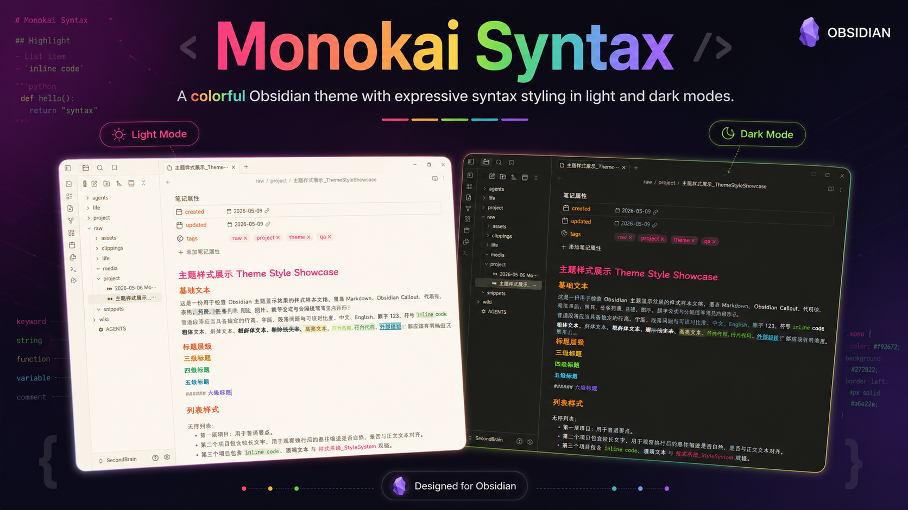

# Monokai Syntax

[Chinese README](./README.zh.md)

Monokai Syntax is a Monokai Pro inspired theme for Obsidian. It is designed for code learning notes, long-form technical writing, and daily knowledge work where reading mode, Live Preview, file navigation, code blocks, callouts, Graph view, and Canvas should feel like one coherent workspace.



## Version

Current version: `1.1.0`

Minimum Obsidian version: `1.0.0`

## Highlights

- Monokai Pro inspired dark palette and a tuned Light palette.
- Style Settings palette selector with `Follow system`, `Pro`, and `Light`.
- CodeMirror 6 syntax colors mapped to a Monokai-style spectrum.
- Reading mode and Live Preview share the same semantic spacing, typography, code, callout, blockquote, tag, task, table, and link variables.
- File tree icons for common Markdown, project, configuration, code, and Obsidian-specific files.
- First-level folders keep Obsidian's native folder chevrons; nested folders use the Monokai custom folder marker without duplicate icons.
- Code learning callouts for `concept`, `syntax`, `api`, `debug`, `pitfall`, `exercise`, `answer`, `source`, `output`, and `terminal`.
- Task states, API parameter tables, inline code, code blocks, Mermaid, Math, Dataview, embeds, images, tags, links, and footnotes are styled for technical notes.
- Graph view, Canvas, Ribbon, tabs, modals, search, settings, and plugin surfaces follow the same theme tokens.
- No runtime remote assets. The icon font is bundled as an inline WOFF resource.

## What's New In 1.1.0

- Kept the palette system focused on Pro, Light, and system-following behavior.
- Improved code blocks, inline code, active line, selection, cursor, gutter, and bracket match states.
- Expanded CodeMirror token coverage for classes, types, built-ins, properties, metadata, and errors.
- Added code-learning callout styles and semantic task states for study notes.
- Reworked file tree icon alignment and folder icon rules.
- Improved reading mode and Live Preview consistency for headings, lists, blockquotes, callouts, code, tables, tags, and links.
- Added Style Settings controls for typography, density, file icons, heading accents, accent color, link color, and code color.
- Added release checks for version consistency, palette coverage, icons, Graph variables, visual polish, contrast, generated assets, and CSS quality.
- Added a CSS audit guard that rejects remote resources, `!important`, ID selectors, and Stylelint control comments in the published CSS.

## Installation

### Manual Installation

Create this folder in your Obsidian vault:

```text
Your Vault/.obsidian/themes/Monokai Syntax/
```

Copy these files into that folder:

```text
theme.css
manifest.json
```

Then open Obsidian and choose `Settings` -> `Appearance` -> `Themes` -> `Monokai Syntax`.

### GitHub Release

After a release is published, download these assets from the release page:

```text
theme.css
manifest.json
```

Place them in your vault theme folder.

### Obsidian Community Theme Listing

To list this theme in Obsidian's community theme browser, submit the required theme metadata to `obsidianmd/obsidian-releases` and wait for review.

## Style Settings

The theme works without extra plugins, but the Obsidian community plugin `Style Settings` unlocks the full configuration surface.

Supported controls include:

- Palette filter: `Follow system`, `Pro`, `Light`.
- Density mode.
- Colored or monochrome file icons.
- File icon visibility.
- Sync button visibility in the status bar.
- Typography and layout controls.
- Heading accents.
- Accent, link, and code color overrides.

## Local Development

Install dependencies:

```powershell
npm install
```

Build the theme:

```powershell
npm run build
```

Run the full verification suite:

```powershell
npm run verify
```

Build and sync to the default Obsidian vault:

```powershell
npm run build:vault
```

Run release checks:

```powershell
npm run release:pack
```

## Release Workflow

1. Keep `package.json`, `manifest.json`, and `versions.json` versions aligned.
2. Run `npm run release:pack`.
3. Confirm the root release assets exist:

```text
theme.css
manifest.json
```

4. Create and push a version tag, for example:

```powershell
git tag v1.1.0
git push origin v1.1.0
```

5. GitHub Actions runs the release verification and publishes a release with `theme.css` and `manifest.json`.

## Verification Coverage

The release verification suite covers:

- Version consistency.
- Palette filter configuration.
- Inline code, editor, and reading mode consistency.
- File icon generation and icon rules.
- Graph view variables.
- Active visual overrides.
- Style polish checks.
- Node tests.
- Stylelint.
- WCAG contrast checks.
- Build output consistency.
- CSS audit for remote resources, `!important`, ID selectors, and Stylelint control comments.

## License

MIT. See [LICENSE.md](./LICENSE.md).
