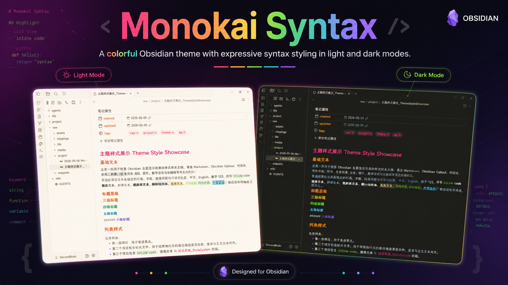

# Monokai Syntax

[Chinese README](./README.zh.md)

Monokai Syntax is a Monokai Pro inspired theme for Obsidian. It is designed for code learning notes, long-form technical writing, and daily knowledge work where reading mode, Live Preview, file navigation, code blocks, callouts, Graph view, and Canvas should feel like one coherent workspace.

## Version

Current version: `1.1.8`

Minimum Obsidian version: `1.5.8`

## What's New In 1.1.8

- **Compatibility:** `minAppVersion` lifted `1.0.0 → 1.5.8` to silence `css-relative-colors / css-scrollbar / text-decoration` warnings (Obsidian 1.5.8 ≈ Electron 28 / Chrome 118 fully supports `rgb(from ...)` / `color-mix`).
- **Bundle size:** `icons.woff (14.1KB) → icons.woff2 (11.6KB)` via `fontTools + brotli` (`+18%` smaller base64), `font-display: swap` already landed; `theme.css` `161KB → ~158KB` (gzip `~34.7KB`).

## What's New In 1.1.7

Monokai Pro Default filter fidelity + editor engineering polish:

- **Palette fidelity:** `H1` returns to spectrum red `#FF6188` (uses `font-weight` to differentiate, no more `#FF9AB0`); sidebar `hover` (`#3D3A3E`) now separated from `border` (`#403E41`), divider `6%` / scrollbar thumb `12%` for clearer hierarchy; code comment `#727072 → #7A757C` (contrast 3.32 → 3.62, threshold lifted to 3.5).
- **Light palette:** codeblock background fixed to `#EBE8DF` with border `#C8C2B2` (1.45:1), header `#EDE9DF`; `check-contrast` fixtures aligned to real tokens (`#FAF8F2 / #F0EEE7 / #EBE8DF`).
- **Typography:** text stack adds `Noto Sans SC / PingFang SC / Microsoft YaHei`, mono adds `JetBrains Mono / Maple Mono / Noto Sans Mono SC`; `type/class` and `decorator` no longer italic by default (keeps Pro's keyword-only italic), new Style Settings toggles `Type italic` / `Decorator italic` (off by default).
- **Editor gutter:** `translateX(-100% + 0.25rem)` hack → `display:flex` with `padding-inline-end: 1rem` and `transform:none`, robust across zoom/font-size.
- **Tables:** `min-width: min(100%,48rem)` → `0`, wrapper `overflow-x:auto`, first column `nowrap 5.5rem → anywhere`, fixed overflow on mobile/split view.
- **Interactions:** tag `translateY/box-shadow → border-color` only, link underline `0.3s → 200ms + will-change`; unified `focus-visible` rings for file tree, tags, graph and canvas.
- **Engineering:** `$color-pro-comment` single source, `--monokai-editor-selection-background` aliases `--monokai-selection-background`; font `display:block → swap` and auto `woff2` via `icons.woff2` if present; checkbox border `1.5px` for visibility.
- **Polish:** `blockquote` shadow removed in dark (kept in light); `CODE` label `inset-inline-end` `+1.8rem` to avoid overlapping `Copy` button; default palette filter `Follow system → Pro`.

## What's New In 1.1.6

- Added a "Line numbers display" option in Style Settings under Typography (Default/Follow Obsidian, Show line numbers, Hide line numbers).
- Fixed folder arrow rotation for nested folders (level 2 and deeper) in the file explorer to point down when expanded and right when collapsed, with smooth transition animations.
- Refined the Obsidian settings modal content area background in light mode to use soft warm Monokai paper surfaces instead of stark pure white.

## Highlights

- Monokai Pro **Default (Pro/Octagon #2D2A2E)** dark palette and a tuned Light paper palette (`#FAF8F2`).
- Style Settings palette selector with `Follow system`, `Pro` (default), and `Light`; single-source `monokai-filter` mixin covering 80 semantic tokens.
- CodeMirror 6 syntax mapped to spectrum `#FF6188 #FC9867 #FFD866 #A9DC76 #78DCE8 #AB9DF2`; keyword-only italic by default, optional type/decorator italics.
- Reading mode and Live Preview share semantic spacing, typography, code, callout, blockquote, tag, task, table, and link variables.
- CJK-friendly font stacks: `Inter + Noto Sans SC / PingFang SC` and `Fira Code + JetBrains Mono / Maple Mono`.
- File tree icons for Markdown, project, config, code and Obsidian files; first-level keeps native chevron, nested uses Monokai marker.
- Code learning callouts for `concept`, `syntax`, `api`, `debug`, `pitfall`, `exercise`, `answer`, `source`, `output`, and `terminal`; rail style with `6%/12%` sidebar tokens.
- Task states, API parameter tables (responsive, `anywhere` wrap), inline code, code blocks (distinct light background), Mermaid, Math, Dataview, embeds, images, tags, links and footnotes optimized for technical notes.
- Graph view, Canvas, Ribbon, tabs, modals, search, settings and plugin surfaces follow the same tokens; no remote assets, icon font bundled as inline `woff` (`swap`, `woff2` auto).
- Full verification: `check:contrast` (30 pairs), `audit:css` (no `!important`/remote), `verify:palette/active-visual` and 39 unit tests.

## License

MIT. See [LICENSE.md](./LICENSE.md).
